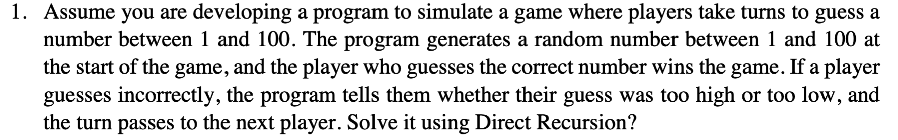
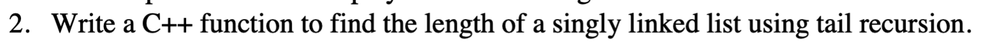
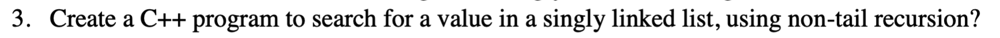
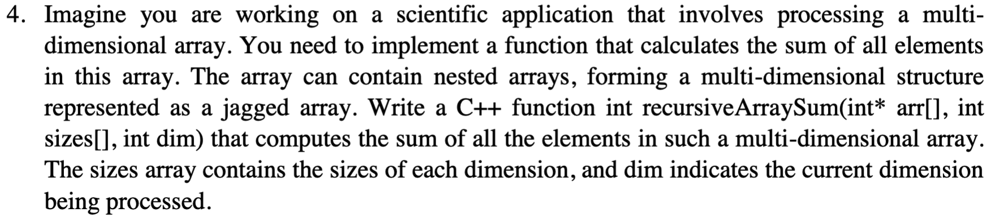
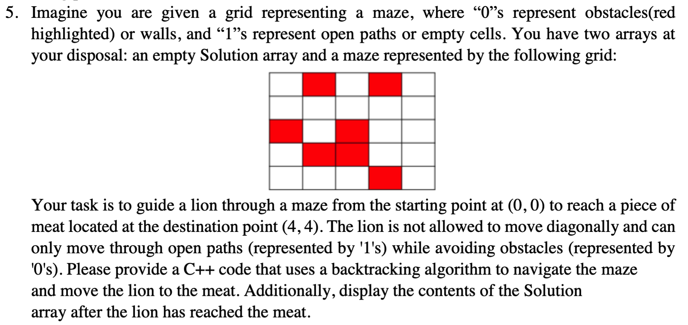
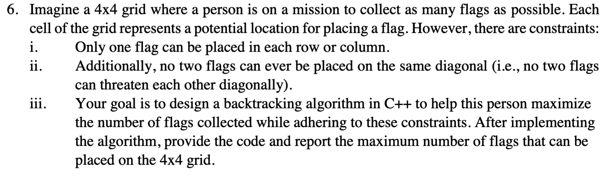

## _Lab-05 - Recursions & Backtracking_

### Task-01



#### Solution

```CPP
#include <iostream>
#include <cstdlib>
#include <ctime>

using namespace std;

void guessNumber(int target, int player)
{
    int guess;
    cout << "Player-0" << player << endl;
    cout << "Enter Your Guess: ";
    cin >> guess;

    if (guess == target)
    {
        cout << "Congratulations Player-0" << player << "! You Guessed the Correct Number!" << endl;
    }
    else
    {
        if (guess < target)
        {
            cout << "low!" << endl
                 << endl;
        }
        else
        {
            cout << "high!" << endl
                 << endl;
        }
        guessNumber(target, player == 1 ? 2 : 1);
    }
}

int main()
{
    srand(time(0));
    int num = ((rand() % 100) + 1);

    cout << "Welcome to the Number Guessing Game!" << endl;
    cout << "Players take turns to guess a number between 1 and 100." << endl
         << endl;

    guessNumber(num, 1);

    return 0;
}
```

### Task-02


Write a C++ function to find the length of a singly linked list using tail recursion.

#### Solution

```CPP
#include <iostream>
using namespace std;

class Node
{
public:
    int val;
    Node *next;
    Node(int value) : val(value), next(nullptr) {}
};

int findLength(Node *n, int count)
{
    if (n == nullptr)
    {
        return count;
    }
    return findLength(n->next, count + 1);
}

int main()
{
    // creating nodes...!
    Node *head = new Node(9);
    head->next = new Node(18);
    head->next->next = new Node(108);
    head->next->next->next = new Node(432);

    int result = findLength(head, 0); // initially count is set to zero...!
    cout << "Length of the linked list: " << result << endl;

    Node *curr = head;
    while (curr != nullptr)
    {
        Node *n = curr->next;
        delete curr;
        curr = n;
    }

    return 0;
}
```

### Task-03


Create a C++ program to search for a value in a singly linked list, using non-tailrecursion.

#### Solution

```CPP
#include <iostream>
using namespace std;

class Node
{
public:
    int data;
    Node *next;
    Node(int value) : data(value), next(nullptr) {}
};

bool searchValue(Node *n, int target)
{
    if (n == nullptr)
    {
        return false;
    }

    if (n->data == target)
    {
        return true;
    }

    return searchValue(n->next, target);
}

int main()
{

    int target = 9;

    Node *head = new Node(9);
    head->next = new Node(18);
    head->next->next = new Node(108);
    head->next->next->next = new Node(432);

    if (searchValue(head, target))
    {
        cout << target << " does exists in the linked list!" << endl;
    }
    else
    {
        cout << target << " doesnot exists in the linked list!" << endl;
    }

    Node *curr = head;
    while (curr != nullptr)
    {
        Node *n = curr->next;
        delete curr;
        curr = n;
    }

    return 0;
}
```

### Task-04



##### Solution
```CPP
#include <iostream>
using namespace std;

int recursiveArraySum(int **arr, int sizes[], int dim)
{
    if (dim == 1)
    {
        int sum = 0;
        for (int i = 0; i < sizes[0]; i++)
        {
            sum += arr[0][i];
        }
        return sum;
    }

    int sum = 0;
    for (int i = 0; i < sizes[0]; i++)
    {
        sum += recursiveArraySum(arr + i, sizes + 1, dim - 1);
    }
    return sum;
}

int main()
{
    int first_array[] = {9, 18, 45, 3};
    int second_array[] = {33, 41, 32, 13};
    int third_array[] = {12, 34, 44, 22};

    int *arr[] = {first_array, second_array, third_array};

    // arr is a 2D array so, 
    int dimensions = 2;
    int sizes[] = {3, 4}; // 3 -> number of arrays in arr, 4 -> number of elements in each array

    int sum = recursiveArraySum(arr, sizes, dimensions);
    cout << "Sum of all the elements of these three arrays is: " << sum << endl;

    return 0;
}
```

### Task-05



##### Solution
```CPP
#include <iostream>
using namespace std;

const int N = 5;
bool solveMaze(int maze[N][N], int x, int y, int solution_array[N][N])
{
    if ((x == N - 1) && (y == N - 1) && (maze[x][y] == 1))
    {
        solution_array[x][y] = 1;
        return true;
    }

    if (((x >= 0) && (y >= 0) && (x < N) && (y < N) && (maze[x][y] == 1)))
    {
        solution_array[x][y] = 1;

        if (solveMaze(maze, x + 1, y, solution_array) || solveMaze(maze, x, y + 1, solution_array))
        {
            return true;
        }

        solution_array[x][y] = 0;
        return false;
    }
    return false;
}

int main()
{
    int maze[N][N] = {{1, 0, 1, 0, 1},
                      {1, 1, 1, 1, 1},
                      {0, 1, 0, 1, 1},
                      {1, 0, 0, 1, 1},
                      {1, 1, 1, 0, 1}};

    int solution_array[N][N] = {0};

    if (solveMaze(maze, 0, 0, solution_array))
    {
        cout << "The lion has reached the meat...!" << endl
             << endl;
        cout << "Solution array:" << endl;
        for (int i = 0; i < N; ++i)
        {
            for (int j = 0; j < N; ++j)
            {
                cout << solution_array[i][j] << " ";
            }
            cout << endl;
        }
        cout << "-----------------------" << endl;
    }
    else
    {
        cout << "The lion could not reach the meat." << endl;
    }

    return 0;
}
```

### Task-06



##### Solution

```CPP
#include <iostream>
#include <cmath>

using namespace std;

const int N = 4;
int maximum_flags = 0;

bool isSafe(int grid[], int row, int col) {
    for (int i = 0; i < row; i++) {
        if ((grid[i] == col) || ((abs(grid[i] - col)) == (abs(i - row)))) {
            return false;
        }
    }
    return true;
}

void placeFlags(int grid[], int row, int flagsPlaced) {
    if (row == N) {
        maximum_flags = max(maximum_flags, flagsPlaced);
        return;
    }

    for (int col = 0; col < N; col++) {
        if (isSafe(grid, row, col)) {
            grid[row] = col;
            placeFlags(grid, row + 1, flagsPlaced + 1);
            grid[row] = -1;
        }
    }
    placeFlags(grid, row + 1, flagsPlaced);
}

int main() {
    int grid[N];
    for (int i = 0; i < N; i++) {
        grid[i] = -1;
    }
    placeFlags(grid, 0, 0);
    cout << "Maximum number of flags that can be placed: " << maximum_flags << endl;
    return 0;
}
```