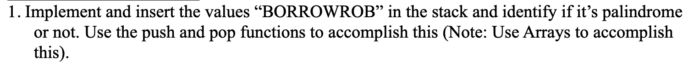
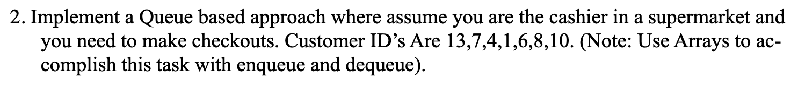
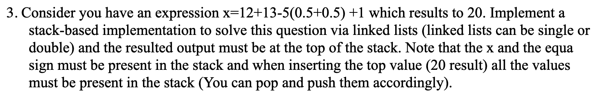

## _Lab-06 - Stacks & Queues_

### Task-01



#### Solution

```CPP
#include <iostream>
#include <cstring>

using namespace std;
const int MAX = 100;

class Stack
{
private:
    char data[MAX];
    int top;

public:
    Stack() : top(-1) {}
    void push(char value);
    char pop();
    char peek();
    bool is_empty();
};

void Stack::push(char value)
{
    if (top < (MAX - 1))
    {
        data[++top] = value;
    }
    else
    {
        cout << "Stack Overflow!" << endl;
    }
}

char Stack::pop()
{
    if (top >= 0)
    {
        return data[top--];
    }
    else
    {
        cout << "Stack Underflow!" << endl;
        return ' ';
    }
}

char Stack::peek()
{
    if (top < 0)
    {
        cout << "Empty Stack!" << endl;
        return 0;
    }
    return data[top];
}

bool Stack::is_empty()
{
    return (top < 0);
}

bool is_palindrome(const char *word)
{
    Stack stack;
    int length = strlen(word);

    for (int i = 0; i < length; i++)
    {
        stack.push(word[i]);
    }

    for (int i = 0; i < length; i++)
    {
        if (word[i] != stack.pop()) // stack.pop() will keep returning the ending characters which will then be compared with the "words" character array!
        {
            return false;
        }
    }

    return true;
}

int main()
{
    const char *word = "BORROWROB";
    if (is_palindrome(word))
    {
        cout << word << " is Palindrome!" << endl;
    }
    else
    {
        cout << word << " is not a Palindrome!" << endl;
    }

    return 0;
}
```

### Task-02



#### Solution

```CPP
#include <iostream>

using namespace std;
const int MAX = 100;

class Queue
{
private:
    int queue[MAX];
    int front, rear, size;

public:
    Queue() : front(0), rear(0), size(0) {}

    void enqueue(int customer_id)
    {
        if (size == MAX)
        {
            cout << "Queue is full." << endl;
            return;
        }

        queue[rear] = customer_id;
        rear = (rear + 1) % MAX;
        size++;
        cout << "Customer with customer_ID \"" << customer_id << "\" added to the queue...!" << endl;
    }

    void dequeue()
    {
        if (size == 0)
        {
            cout << "Queue is empty." << endl;
            return;
        }

        int customer_id = queue[front];
        front = (front + 1) % MAX;
        size--;
        cout << "Customer with customer_ID \"" << customer_id << "\" checked out." << endl;
    }

    void display_queue()
    {
        if (size == 0)
        {
            cout << "Queue is Empty...!" << endl;
            return;
        }
        cout << "Current Queue: ";
        int temp = front;
        for (int i = 0; i < size; i++)
        {
            cout << queue[temp] << " ";
            temp = (temp + 1) % MAX;
        }
        cout << "\n--------------------------------------------" << endl;
    }

    bool is_empty()
    {
        return (size == 0);
    }
};

int main()
{
    Queue checkout_queue;

    int customer_ids[] = {13, 7, 4, 1, 6, 8, 10};
    int number_of_customers = sizeof(customer_ids) / sizeof(customer_ids[0]);

    for (int i = 0; i < number_of_customers; i++)
    {
        checkout_queue.enqueue(customer_ids[i]);
    }

    checkout_queue.display_queue();
    // cout << "_____________________________" << endl;

    while (!checkout_queue.is_empty())
    {
        checkout_queue.dequeue();
        checkout_queue.display_queue();
    }

    return 0;
}
```

### Task-03



#### Solution

```CPP
#include <iostream>
#include <string>
#include <cctype>
#include <cmath>
#include <iomanip>

using namespace std;

class Node
{
public:
    string data;
    Node *next;

    Node(string value)
    {
        data = value;
        next = nullptr;
    }
};

class Stack
{
private:
    Node *top;

public:
    Stack() : top(nullptr) {}

    ~Stack()
    {
        while (top)
        {
            Node *temp = top;
            top = top->next;
            delete temp;
        }
    }

    void push(string value)
    {
        Node *newNode = new Node(value);
        newNode->next = top;
        top = newNode;
    }

    string pop()
    {
        if (top == nullptr)
        {
            return "";
        }

        string value = top->data;
        Node *temp = top;
        top = top->next;
        delete temp;
        return value;
    }

    string peek()
    {
        if (top)
            return top->data;

        return "";
    }

    bool isEmpty()
    {
        return (top == nullptr);
    }
};

int precedence(char op)
{
    if (op == '+' || op == '-')
        return 1;
    else if (op == '*' || op == '/')
        return 2;
    else if (op == '^')
        return 3;

    return -1;
}

bool isOperator(char op)
{
    if (op == '+' || op == '-' || op == '*' || op == '/' || op == '^')
        return true;

    return false;
}

string infixToPostfix(const string &infix)
{
    Stack st;
    string postfix;
    string number;

    for (int i = 0; i < infix.length(); ++i)
    {
        char c = infix[i];
        if (isdigit(c) || c == '.')
        {
            number += c;
        }
        else
        {
            if (!number.empty())
            {
                postfix += number + ' ';
                number.clear();
            }
            if (isalpha(c))
            {
                postfix += c;
            }
            else if (c == '(')
            {
                st.push(string(1, c));
            }
            else if (c == ')')
            {
                while (!st.isEmpty() && st.peek()[0] != '(')
                {
                    postfix += st.pop() + ' ';
                }
                st.pop();
            }
            else if (isOperator(c))
            {
                while (!st.isEmpty() && precedence(st.peek()[0]) >= precedence(c))
                {
                    postfix += st.pop() + ' ';
                }
                st.push(string(1, c));
            }
        }
    }

    if (!number.empty())
    {
        postfix += number + ' ';
    }

    while (!st.isEmpty())
    {
        postfix += st.pop() + ' ';
    }

    return postfix;
}

double evaluatePostfix(const string &postfix)
{
    Stack st;
    string token;
    for (int i = 0; i < postfix.length(); ++i)
    {
        char c = postfix[i];
        if (isdigit(c) || c == '.')
        {
            token += c;
        }
        else if (c == ' ' && !token.empty())
        {
            st.push(token);
            token.clear();
        }
        else if (isOperator(c))
        {
            double op2 = stod(st.pop());
            double op1 = stod(st.pop());

            double result;

            if (c == '+')
                result = op1 + op2;
            else if (c == '-')
                result = op1 - op2;
            else if (c == '*')
                result = op1 * op2;
            else if (c == '/')
                result = op1 / op2;
            else if (c == '^')
                result = pow(op1, op2);
            else
                return 0;

            st.push(to_string(result));
        }
    }
    return stod(st.pop());
}

int main()
{
    string expression = "12+13-5*(0.5+0.5)+1";
    string infix = "x=" + expression;

    cout << "Infix Expression: " << infix << endl
         << endl;

    string postfix = infixToPostfix(expression);
    cout << "Postfix Expression: " << postfix << endl;

    double result = evaluatePostfix(postfix);

    cout << fixed << setprecision(2); // fixed and setprecision() are just for formatting
    cout << "Result: " << result << endl;

    Stack st;
    st.push("x=");
    st.push(to_string(result));

    cout << "\nFinal Stack Contents:" << endl;

    string value = st.pop();
    cout << fixed << setprecision(2) << stod(value) << endl;
    string x = st.pop();
    cout << x << endl;

    cout << x << fixed << setprecision(2) << stod(value) << endl;

    return 0;
}
```