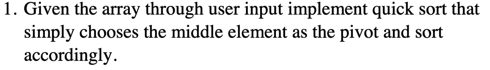
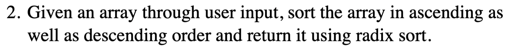
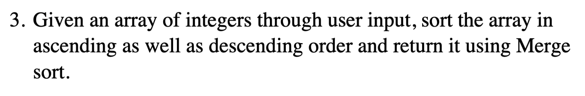

## _Lab-07 - Quick Sort | Merge Sort | Radix Sort_

### Task-01



#### Solution

```CPP
#include <iostream>
using namespace std;

void swap(int &a, int &b)
{
    int temp = a;
    a = b;
    b = temp;
}

int partition(int arr[], int low, int high)
{
    int mid = low + (high - low) / 2;
    int pivot = arr[mid];

    swap(arr[mid], arr[high]);

    int i = (low - 1);

    for (int j = low; j < high; j++)
    {
        if (arr[j] <= pivot)
        {
            i++;
            swap(arr[i], arr[j]);
        }
    }
    swap(arr[i + 1], arr[high]);
    return (i + 1);
}

void quickSort(int arr[], int low, int high)
{
    if (low < high)
    {
        int pi = partition(arr, low, high);

        quickSort(arr, low, pi - 1);
        quickSort(arr, pi + 1, high);
    }
}

void printArray(int arr[], int size)
{
    for (int i = 0; i < size; i++)
    {
        cout << arr[i] << " ";
    }
    cout << endl;
}

int main()
{
    int n;

    cout << "Enter the number of elements: ";
    cin >> n;

    int *arr = new int[n];
    for (int i = 0; i < n; i++)
    {
        if (i == 0)
        {
            cout << "Enter " << i + 1 << "st element: ";
        }
        else if (i == 1)
        {
            cout << "Enter " << i + 1 << "nd element: ";
        }
        else if (i == 2)
        {
            cout << "Enter " << i + 1 << "rd element: ";
        }
        else
        {
            cout << "Enter " << i + 1 << "th element: ";
        }
        cin >> arr[i];
    }

    cout << "\nOriginal array: ";
    printArray(arr, n);

    quickSort(arr, 0, n - 1);
    cout << "Sorted array: ";
    printArray(arr, n);

    delete[] arr;
    return 0;
}
```

### Task-02



#### Solution

```CPP
#include <iostream>
using namespace std;

int getMax(int arr[], int n)
{
    int max = arr[0];
    for (int i = 1; i < n; i++)
    {
        if (arr[i] > max)
        {
            max = arr[i];
        }
    }
    return max;
}

void countingSort(int arr[], int n, int exp)
{
    int output[n];
    int count[10] = {0};

    for (int i = 0; i < n; i++)
    {
        int digit = (arr[i] / exp) % 10;
        count[digit]++;
    }

    for (int i = 1; i < 10; i++)
    {
        count[i] += count[i - 1];
    }

    for (int i = n - 1; i >= 0; i--)
    {
        int digit = (arr[i] / exp) % 10;
        output[count[digit] - 1] = arr[i];
        count[digit]--;
    }

    for (int i = 0; i < n; i++)
    {
        arr[i] = output[i];
    }
}

void radixsort(int arr[], int n, bool ascending = true)
{
    int max = getMax(arr, n);

    for (int exp = 1; max / exp > 0; exp *= 10)
    {
        countingSort(arr, n, exp);
    }

    // reverse the array for descending order
    if (!ascending)
    {
        int left = 0, right = n - 1;
        while (left < right)
        {
            int temp = arr[left];
            arr[left] = arr[right];
            arr[right] = temp;
            left++;
            right--;
        }
    }
}

void printArray(int arr[], int n)
{
    for (int i = 0; i < n; i++)
    {
        cout << arr[i] << " ";
    }
    cout << endl;
}

int main()
{
    int n;
    cout << "Enter the number of elements: ";
    cin >> n;

    int *arr = new int[n];
    for (int i = 0; i < n; i++)
    {
        if (i == 0)
        {
            cout << "Enter " << i + 1 << "st element: ";
        }
        else if (i == 1)
        {
            cout << "Enter " << i + 1 << "nd element: ";
        }
        else if (i == 2)
        {
            cout << "Enter " << i + 1 << "rd element: ";
        }
        else
        {
            cout << "Enter " << i + 1 << "th element: ";
        }
        cin >> arr[i];
    }

    int *descendingOrder_array = new int[n];
    for (int i = 0; i < n; i++)
    {
        descendingOrder_array[i] = arr[i];
    }

    radixsort(arr, n);
    radixsort(descendingOrder_array, n, false);

    cout << "\nSorted array in ascending order: ";
    printArray(arr, n);

    cout << "Sorted array in descending order: ";
    printArray(descendingOrder_array, n);

    delete[] arr;
    delete[] descendingOrder_array;

    return 0;
}
```

### Task-03



#### Solution

```CPP
#include <iostream>
using namespace std;

void merge(int arr[], int left, int mid, int right, bool ascending)
{
    int n1 = mid - left + 1;
    int n2 = right - mid;

    int *leftArr = new int[n1];
    int *rightArr = new int[n2];

    for (int i = 0; i < n1; i++)
    {
        leftArr[i] = arr[left + i];
    }
    for (int i = 0; i < n2; i++)
    {
        rightArr[i] = arr[mid + 1 + i];
    }

    int i = 0;
    int j = 0;
    int k = left;
    while (i < n1 && j < n2)
    {
        if (ascending)
        {
            if (leftArr[i] <= rightArr[j])
            {
                arr[k] = leftArr[i];
                i++;
            }
            else
            {
                arr[k] = rightArr[j];
                j++;
            }
        }
        else
        {
            if (leftArr[i] >= rightArr[j])
            {
                arr[k] = leftArr[i];
                i++;
            }
            else
            {
                arr[k] = rightArr[j];
                j++;
            }
        }
        k++;
    }

    while (i < n1)
    {
        arr[k] = leftArr[i];
        i++;
        k++;
    }
    while (j < n2)
    {
        arr[k] = rightArr[j];
        j++;
        k++;
    }

    delete[] leftArr;
    delete[] rightArr;
}

void mergeSort(int arr[], int left, int right, bool ascending)
{
    if (left < right)
    {
        int mid = left + (right - left) / 2;

        mergeSort(arr, left, mid, ascending);
        mergeSort(arr, mid + 1, right, ascending);

        merge(arr, left, mid, right, ascending);
    }
}

void printArray(int arr[], int n)
{
    for (int i = 0; i < n; i++)
    {
        cout << arr[i] << " ";
    }
    cout << endl;
}

int main()
{
    int n;
    cout << "Enter the number of elements: ";
    cin >> n;

    int *arr = new int[n];
    cout << "Enter the array elements: ";
    for (int i = 0; i < n; i++)
    {
        if (i == 0)
        {
            cout << "Enter " << i + 1 << "st element: ";
        }
        else if (i == 1)
        {
            cout << "Enter " << i + 1 << "nd element: ";
        }
        else if (i == 2)
        {
            cout << "Enter " << i + 1 << "rd element: ";
        }
        else
        {
            cout << "Enter " << i + 1 << "th element: ";
        }
        cin >> arr[i];
    }

    int *descendingOrder_array = new int[n];
    for (int i = 0; i < n; i++)
    {
        descendingOrder_array[i] = arr[i];
    }

    mergeSort(arr, 0, n - 1, true);
    mergeSort(descendingOrder_array, 0, n - 1, false);

    cout << "\nSorted array in ascending order: ";
    printArray(arr, n);

    cout << "Sorted array in descending order: ";
    printArray(descendingOrder_array, n);

    delete[] arr;
    delete[] descendingOrder_array;

    return 0;
}
```