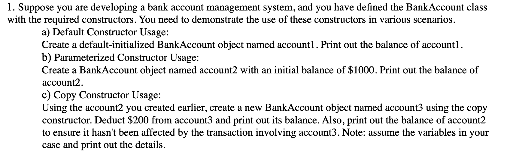
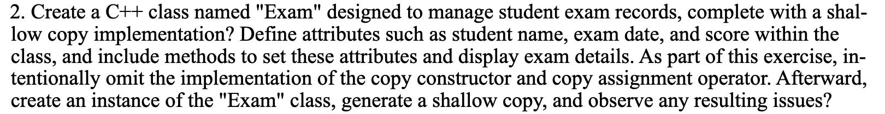
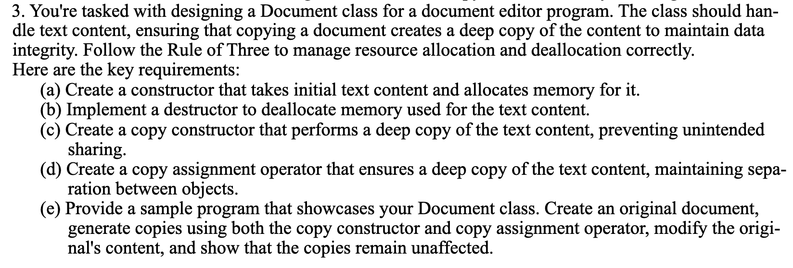
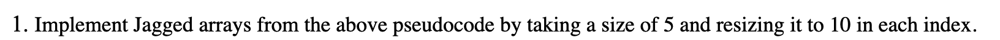
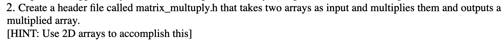
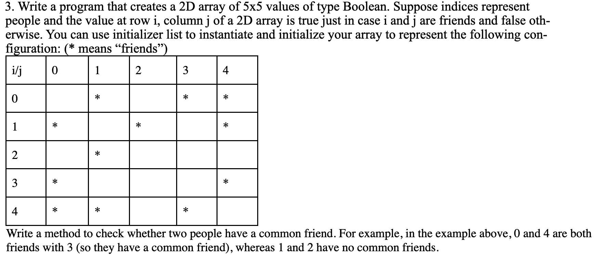
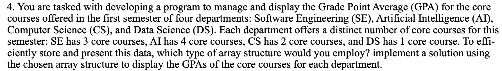
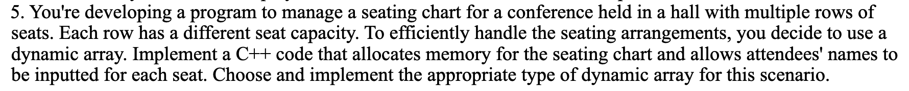

# Data Structures Lab Tasks.

_This repository contains the solution sets of all the assignments of Data Structures Course in my 3rd Semester._

## _Lab-01 (Revision of OOP concepts covered in last semester i.e. 2nd Semester)_

### Task-01



#### Solution

```CPP
#include <iostream>
using namespace std;

class BankAccount
{
    double balance;

public:
    BankAccount()
    {
        this->balance = 0;
    }

    BankAccount(double balance)
    {
        this->balance = balance;
    }

    BankAccount(const BankAccount &account)
    {
        balance = (account.balance) - 200;
    }

    void Display()
    {
        cout << "Your Account Balance is: " << balance << "\n\n";
    }
};

int main()
{
    BankAccount account1;
    account1.Display();

    BankAccount account2(1000);
    account2.Display();

    BankAccount account3(account2);
    account3.Display();
    account2.Display();

    return 0;
}
```

### Task-02



#### Solution

```CPP
#include <iostream>
using namespace std;

class Exam{
    string name;
    string date;
    float score;
    public:
    void setName(string name){
        this->name = name;
    }
    void setDate(string date){
        this->date = date;
    }
    void setScore(float score){
        this->score = score;
    }
    inline void Display(){
        cout<<"\n\t----------Exam Details----------\n";
        cout<<"Name: "<<this->name<<endl;
        cout<<"Score: "<<this->score<<endl;
        cout<<"Date: "<<this->date<<endl;
    }

};

int main()
{
    Exam e1;
    e1.setName("alpha");
    e1.setScore(93);
    e1.setDate("26-08-2021");

    e1.Display();
    Exam e2 = e1;
    e2.setName("Krrishna");
    e2.Display();
    e1.Display();
    return 0;
}

/*
you'll observe that modifying e2's name also affects
e1's name, because they share the same memory location due
to the shallow copy. This is the expected behavior without a
proper copy constructor and copy assignment operator.
*/
```

### Task-03



#### Solution

```CPP
#include <iostream>
#include <string>
using namespace std;

class Document
{
private:
    string *textContent;

public:
    Document()
    {
        textContent = nullptr;
    }

    Document(string content)
    {
        textContent = new string(content);
    }

    Document(const Document &other)
    {
        textContent = new string(*other.textContent);
    }

    Document &operator=(const Document &other)
    {
        if (this != &other)
        {
            delete textContent;
            textContent = new string(*other.textContent);
        }
        return *this;
    }

    const string &getTextContent() const
    {
        return *textContent;
    }

    ~Document()
    {
        delete textContent;
    }
};

int main()
{
    Document doc("Subscribe to codewithalpha Youtube Channel");

    Document copiedDoc(doc);
    Document copyUsingCAO;
    copyUsingCAO = doc;
    doc = Document("Checkout krrishkumar.me for more social handles");

    cout << "\n---------------\n";
    cout << "Original: " << doc.getTextContent() << endl;
    cout << "Copy using Copy Constructor: " << copiedDoc.getTextContent() << endl;
    cout << "Copy using Copy Assignment Operator: " << copyUsingCAO.getTextContent() << endl;
    cout << "--------------------------------\n";

    return 0;
}
```

## _Lab-02 (Array Data Structure)_

### Task-01


1. _Implement Jagged arrays from the above pseudocode by taking a size of 5 and resizing it to 10 in each index._

#### Solution
```CPP
#include <iostream>
using namespace std;

int main()
{

    int **jaggedArray = new int *[5];
    for (int i = 0; i < 5; i++)
    {
        jaggedArray[i] = new int[5];
        for (int j = 0; j < 5; j++)
        {
            jaggedArray[i][j] = (i + j) + 1; // (i + j) + 1 => just adding some values to the array for testing
        }
    }

    cout << "--------------" << endl;
    cout << "Jagged Array Before Resizing: " << endl;
    cout << "---------------------------" << endl;
    for (int i = 0; i < 5; i++)
    {
        for (int j = 0; j < 5; j++)
        {
            cout << jaggedArray[i][j] << " ";
        }
        cout << endl;
    }

    // Resizing the jagged array to 5 x 10
    for (int i = 0; i < 5; i++)
    {
        int *temp = new int[10];
        for (int j = 0; j < 5; j++)
        {
            temp[j] = jaggedArray[i][j];
        }
        for (int j = 5; j < 10; j++)
        {
            temp[j] = 9; // placing 9 to the another 5x5 part of the array. 9 => universal number :)
        }
        delete[] jaggedArray[i];
        jaggedArray[i] = temp;
    }

    cout << "--------------" << endl;
    cout << "Jagged Array After Resizing: " << endl;
    cout << "---------------------------" << endl;
    for (int i = 0; i < 5; i++)
    {
        for (int j = 0; j < 10; j++)
        {
            cout << jaggedArray[i][j] << " ";
        }
        cout << endl;
    }

    // Deallocating the memory here...!
    for (int i = 0; i < 5; i++)
    {
        delete[] jaggedArray[i];
    }
    delete[] jaggedArray;

    return 0;
}
```

### Task-02


2. _Create a header file called matrix_multuply.h that takes two arrays as input and multiplies them and outputs a multiplied array._
#### Solution
##### matrix_multiply.h
```CPP
#ifndef MATRIX_MULTIPLY_H
#define MATRIX_MULTIPLY_H

using namespace std;

// prototype of the matrixMultiplication method!
// check module.cpp for definition.

void matrixMultiplication(int **matrixOne, int **matrixTwo, int **resultantMatrix, int rowsOne, int columnsOne, int rowsTwo, int columnsTwo);

#endif 
```

##### module.cpp
```CPP
#include <iostream>
#include "matrix_multiply.h"
using namespace std;

// definition of the declared method in matrix_multiply.h
void matrixMultiplication(int **matrixOne, int **matrixTwo, int **resultantMatrix, int rowsOne, int columnsOne, int rowsTwo, int columnsTwo)
{

    for (int i = 0; i < rowsOne; i++)
    {
        for (int j = 0; j < columnsTwo; j++)
        {
            for (int k = 0; k < columnsOne; k++)
            {
                resultantMatrix[i][j] = (resultantMatrix[i][j] + (matrixOne[i][k] * matrixTwo[k][j]));
            }
        }
    }
}
```

##### main.cpp
```CPP
#include <iostream>
#include "module.cpp"
using namespace std;

int main()
{
    int rowsOne, columnsOne, rowsTwo, columnsTwo;

    cout << "Enter the number of rows of the first matrix: ";
    cin >> rowsOne;

    cout << "Enter the number of columns of the first matrix: ";
    cin >> columnsOne;

    cout << "Enter the number of rows of the second matrix: ";
    cin >> rowsTwo;

    cout << "Enter the number of columns of the second matrix: ";
    cin >> columnsTwo;

    if (columnsOne != rowsTwo)
    {
        cout << "\nMatrix multiplication not possible.\nProgram Terminated......!\n";
        return 0;
    }

    int **matrixOne = new int *[rowsOne];
    for (int i = 0; i < rowsOne; i++)
    {
        matrixOne[i] = new int[columnsOne];
    }

    int **matrixTwo = new int *[rowsTwo];
    for (int i = 0; i < rowsTwo; i++)
    {
        matrixTwo[i] = new int[columnsTwo];
    }

    int **resultantMatrix = new int *[rowsOne];
    for (int i = 0; i < rowsOne; i++)
    {
        resultantMatrix[i] = new int[columnsTwo];
    }

    cout << endl;
    cout << "Enter the elements of the first matrix:" << endl;
    for (int i = 0; i < rowsOne; i++)
    {
        for (int j = 0; j < columnsOne; j++)
        {
            cout << "Enter element [" << i + 1 << "][" << j + 1 << "]: ";
            cin >> matrixOne[i][j];
        }
    }

    cout << endl;
    cout << "Enter the elements of the second matrix:" << endl;
    for (int i = 0; i < rowsTwo; i++)
    {
        for (int j = 0; j < columnsTwo; j++)
        {
            cout << "Enter element [" << i + 1 << "][" << j + 1 << "]: ";
            cin >> matrixTwo[i][j];
        }
    }

    matrixMultiplication(matrixOne, matrixTwo, resultantMatrix, rowsOne, columnsOne, rowsTwo, columnsTwo);

    cout<<"-----------------------------"<<endl;
    cout << "Resultant Matrix:" << endl;
    for (int i = 0; i < rowsOne; i++)
    {
        for (int j = 0; j < columnsTwo; j++)
        {
            cout << resultantMatrix[i][j] << "\t";
        }
        cout << endl;
    }
    cout<<"--------------------"<<endl;

    for (int i = 0; i < rowsOne; i++)
    {
        delete[] matrixOne[i];
    }
    delete[] matrixOne;

    for (int i = 0; i < rowsTwo; i++)
    {
        delete[] matrixTwo[i];
    }
    delete[] matrixTwo;

    for (int i = 0; i < rowsOne; i++)
    {
        delete[] resultantMatrix[i];
    }
    delete[] resultantMatrix;

    return 0;
}
```

### Task-03

#### Solution
```CPP
#include <iostream>
using namespace std;

class FriendsArray {
private:
    static const int n = 5;
    static bool friends[n][n];

public:
    static bool commonFriend(int personOne, int personTwo) {
        for (int i = 0; i < n; i++) {
            if ((friends[personOne][i]) && (friends[personTwo][i])) {
                return true;
            }
        }
        return false;
    }
};

// Initialize the static member
bool FriendsArray::friends[n][n] = {
    {false, true, false, true, false},
    {true, false, true, false, true},
    {false, true, false, false, false},
    {true, false, false, false, true},
    {true, true, false, true, false}
};

int main() {
    // test the program and verify by changing the index value of the two persons here...!
    int personOne = 2;
    int personTwo = 3;

    if (FriendsArray::commonFriend(personOne, personTwo)) {
        cout << personOne << " and " << personTwo << " have a common friend." << endl;
    } else {
        cout << personOne << " and " << personTwo << " have no common friend." << endl;
    }

    return 0;
}

```

### Task-04



#### Solution
```CPP
#include <iostream>
using namespace std;

void Display(double gpa[][4], string Departments[], int courses[], int number_of_departments)
{
    for (int i = 0; i < number_of_departments; i++)
    {
        cout << "------------" << endl;
        cout << "Department: " << Departments[i] << endl;
        for (int j = 0; j < courses[i]; j++)
        {
            cout << "Course " << j + 1 << ":\t GPA: " << gpa[i][j] << endl;
        }
        cout << "-------------------------------------" << endl;
    }
}

int main()
{
    const int number_of_departments = 4;
    int courses[] = {3, 4, 2, 1}; // according to Departments

    string Departments[number_of_departments] = {
        "Software Engineering (SE)",
        "Artificial Intelligence (AI)",
        "Computer Science (CS)",
        "Data Science (DS)",
    };

    // hardcoding the values for testing purposes...
    double gpa[number_of_departments][4] = {
        {3.67, 3.48, 3.51},      // Software Engineering
        {3.78, 3.85, 4.0, 3.97}, // Artificial Intelligence
        {3.24, 3.92},            // Computer Science
        {3.9}                    // Data Science
    };

    Display(gpa, Departments, courses, number_of_departments);
    return 0;
}
```

### Task-05



#### Solution
```CPP
#include <iostream>
using namespace std;

int main()
{
    int rows;
    cout << "\nEnter the number of rows: ";
    cin >> rows;
    cout << endl;

    string **seatingChart = new string *[rows];
    int *seatsPerRow = new int[rows];

    for (int i = 0; i < rows; i++)
    {
        int number_of_seats;
        if (i == 0)
        {
            cout << "Enter the number of seats in " << (i + 1) << "st row " << ": ";
        }
        else if (i == 1)
        {
            cout << "Enter the number of seats in " << (i + 1) << "nd row " << ": ";
        }
        else if (i == 2)
        {
            cout << "Enter the number of seats in " << (i + 1) << "rd row " << ": ";
        }
        else
        {
            cout << "Enter the number of seats in " << (i + 1) << "th row " << ": ";
        }
        cin >> number_of_seats;
        seatingChart[i] = new string[number_of_seats];
        seatsPerRow[i] = number_of_seats;

        for (int j = 0; j < number_of_seats; j++)
        {
            cout << "Enter the name for seat " << j + 1 << " in row " << i + 1 << ": ";
            cin >> seatingChart[i][j];
        }
        cout << "-----------------------------" << endl;
    }

    cout << "\n--------------" << endl;
    cout << "Seating Chart: " << endl;

    for (int i = 0; i < rows; i++)
    {
        if (i == 0)
        {
            cout << i + 1 << "st row: ";
        }
        else if (i == 1)
        {
            cout << i + 1 << "nd row: ";
        }
        else if (i == 2)
        {
            cout << i + 1 << "rd row: ";
        }
        else
        {
            cout << i + 1 << "th row: ";
        }

        for (int j = 0; j < seatsPerRow[i]; j++)
        {
            cout << seatingChart[i][j] << " ";
        }
        cout << endl;
    }
    cout << "-----------------------------------" << endl;

    for (int i = 0; i < rows; i++)
    {
        delete[] seatingChart[i];
    }
    delete[] seatingChart;
    delete[] seatsPerRow;

    return 0;
}

```